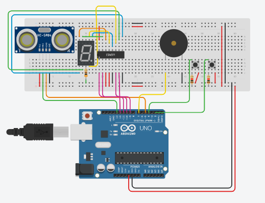

Projeto da disciplina de Fabrica de Projetos

<strong> JUDIT </strong>

A ideia da função Idoso(), é que o aparelho esteja no teto e pegue a distancia dali até a cama, onde o corpo do idoso terá certa altura, logo quando o idoso se levantar, a distância de onde do teto até a cama será maior, assim entrando na condição (distancia > 2 metros) e acionando o alarme.

Na segunda função, a ideia foi da abertura de algum armário, onde a criança abre o armário, dai o aparelho que estará na porta ficará mais distante do fundo do armário, assim aumentando a distancia, logo entrando na condição (distancia > 20cm) e acionado o alarme.
